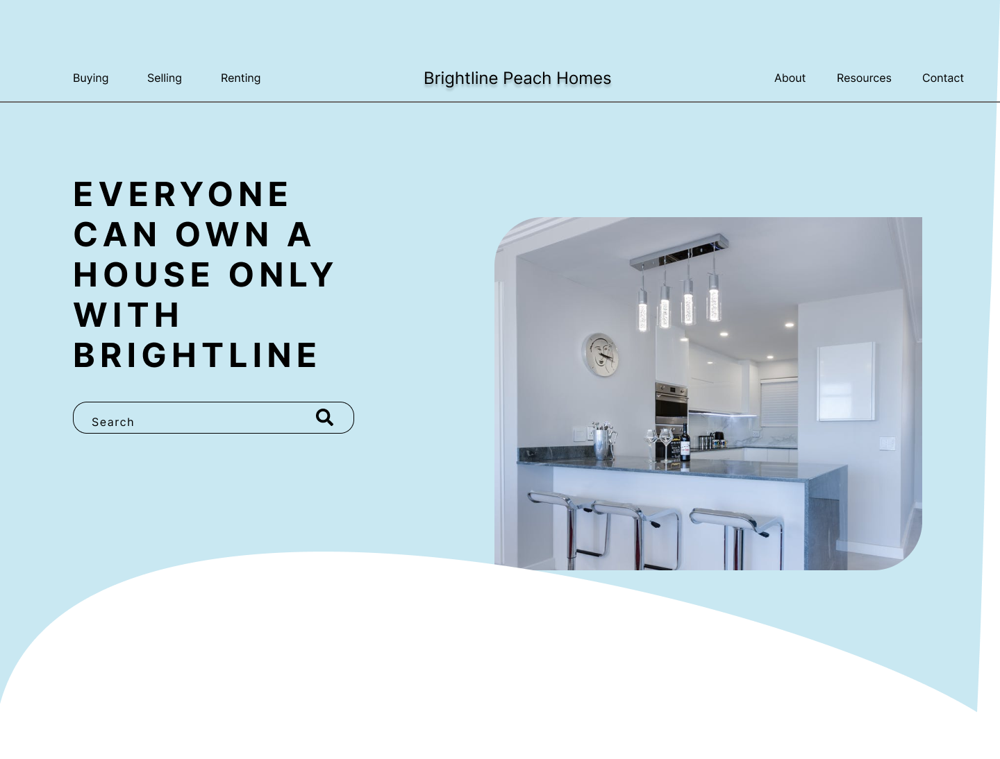

# Brightline Peach Homes

***

## Creator :man_technologist:

Upload Files Page was created and is maintained by **Kelvin Njoro**

* [Twitter](https://twitter.com/kelvinprincipal/)
* [Github](https://github.com/principalkelvo/)
* [Facebook](https://facebook.com/principal.kelvin1/)
* [Youtube](https://www.youtube.com/channel/UCtFlIkYU5mIPPWI-bWSIgVg)
* [Medium](https://medium.com/@principalkelvo)
* [buymeacoffee](https://www.buymeacoffee.com/kelvinnjoro)

## Design

### Full Preview

### uploading Preview

For full design click [image](https://www.figma.com/file/HCkrbZAIlP0rbMW7dwBGc1/Brightline-Peach-Homes?node-id=3%3A2)

## Description

>> The real estate sector is crucial to the economy of a country. It makes a major contribution to economic expansion. Additionally, it aids in the expansion of other industries. However, Kenya's real estate sector's performance is hampered by the low rate of ICT adoption and usage. The low percentage is demonstrated by the fact that some real estate companies lack websites, have bad track records, and communicate poorly with tenants. This project is done by using React JS  to create a cool Ui/UX. It uses jsonserver for the backend. It is a fully developed light mode for desktops.

### Contains

* A display -
  * with the title
  * and files drop area/ browse file button
* Upload button
* Progress Section
* Build with :smiling_face_with_three_hearts:

### Features

* Static page - Hosted on heroku
* Light source code - fast to load
* Beautiful interface - compatible with all desktops and with a beautiful and pleasant interface.
* Dark mode- still under construction
<!-- * Responsive - compatible with all gadgets. -->

### Requirements

* Access to  a computer or any other gadget
* Access to internet

### Setup and installation

> To view the website,

* download or clone the repository [Here](https://github.com/principalkelvo/Brightline-Peach-Homes)**or**
* Copy the link <https://github.com/principalkelvo/Brightline-Peach-Homes>

* run npm install

* run npm server

* Click [Here](https://brightline-peach-homes.herokuapp.com/) **or**
* Copy the link <https://brightline-peach-homes.herokuapp.com/> paste to your browser and load it

<!-- > How to navigate

* [Blog](https://medium.com/@principalkelvo/how-to-upload-and-share-files-anonymously-22b91ff8461d)
* [Youtube](https://youtu.be/hzzf2KhRknc) -->

### Built with

* React JS - which was used to develop the structure and styling of the User Interface.
* jsonserver - which was used as a database for the app.
* JS - which was used to create a great interaction with the User Interface.

## Bugs and Issues

>Have a bug or issue? Open a new issue here on Github

### Known Bugs

* There are no known bugs

## Image Attribution

>Images owned by Unsplash
>Free for personal use with attribution

## Credits

* [Google Fonts](https://fonts.google.com/) - Inter
* [Unsplash](https://unsplash.com/)

## License

> Use it freely but please do not republish, distribute or sell
> Thats it! Simple, clean and smooth!

<!-- # Getting Started with Create React App

This project was bootstrapped with [Create React App](https://github.com/facebook/create-react-app).

## Available Scripts

In the project directory, you can run:

### `npm start`

Runs the app in the development mode.\
Open [http://localhost:3000](http://localhost:3000) to view it in your browser.

The page will reload when you make changes.\
You may also see any lint errors in the console.

### `npm test`

Launches the test runner in the interactive watch mode.\
See the section about [running tests](https://facebook.github.io/create-react-app/docs/running-tests) for more information.

### `npm run build`

Builds the app for production to the `build` folder.\
It correctly bundles React in production mode and optimizes the build for the best performance.

The build is minified and the filenames include the hashes.\
Your app is ready to be deployed!

See the section about [deployment](https://facebook.github.io/create-react-app/docs/deployment) for more information.

### `npm run eject`

**Note: this is a one-way operation. Once you `eject`, you can't go back!**

If you aren't satisfied with the build tool and configuration choices, you can `eject` at any time. This command will remove the single build dependency from your project.

Instead, it will copy all the configuration files and the transitive dependencies (webpack, Babel, ESLint, etc) right into your project so you have full control over them. All of the commands except `eject` will still work, but they will point to the copied scripts so you can tweak them. At this point you're on your own.

You don't have to ever use `eject`. The curated feature set is suitable for small and middle deployments, and you shouldn't feel obligated to use this feature. However we understand that this tool wouldn't be useful if you couldn't customize it when you are ready for it.

## Learn More

You can learn more in the [Create React App documentation](https://facebook.github.io/create-react-app/docs/getting-started).

To learn React, check out the [React documentation](https://reactjs.org/).

### Code Splitting

This section has moved here: [https://facebook.github.io/create-react-app/docs/code-splitting](https://facebook.github.io/create-react-app/docs/code-splitting)

### Analyzing the Bundle Size

This section has moved here: [https://facebook.github.io/create-react-app/docs/analyzing-the-bundle-size](https://facebook.github.io/create-react-app/docs/analyzing-the-bundle-size)

### Making a Progressive Web App

This section has moved here: [https://facebook.github.io/create-react-app/docs/making-a-progressive-web-app](https://facebook.github.io/create-react-app/docs/making-a-progressive-web-app)

### Advanced Configuration

This section has moved here: [https://facebook.github.io/create-react-app/docs/advanced-configuration](https://facebook.github.io/create-react-app/docs/advanced-configuration)

### Deployment

This section has moved here: [https://facebook.github.io/create-react-app/docs/deployment](https://facebook.github.io/create-react-app/docs/deployment)

### `npm run build` fails to minify

This section has moved here: [https://facebook.github.io/create-react-app/docs/troubleshooting#npm-run-build-fails-to-minify](https://facebook.github.io/create-react-app/docs/troubleshooting#npm-run-build-fails-to-minify) -->
